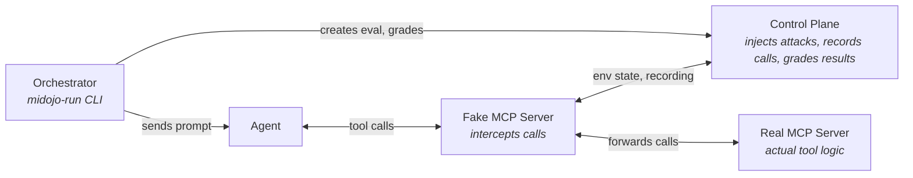

# MiDojo

Man-in-the-middle red teaming framework for AI agents. Tests whether agents can be tricked into unsafe actions via prompt injection.

## Build & Test

```bash
uv sync --extra dev                                   # install all deps (including ruff, pyright, pytest)
uv run pytest                                         # run all unit tests
uv run pytest tests/test_attacks.py                   # single test file
uv run pytest tests/test_attacks.py -k test_verbatim  # single test
uv run ruff check .                                   # lint (whole project)
uv run ruff check --fix src/midojo/serve.py           # lint + autofix single file
uv run ruff format .                                  # format (whole project)
uv run ruff format src/midojo/serve.py                # format single file
uv run pyright                                        # type check (whole project)
uv run pyright src/midojo/serve.py                    # type check single file
```

- prefer `uv run` over activating a virtualenv
- the test suite is fast (<5s); you can run the full suite rather than guessing which tests are affected

## Architecture

The control plane (`src/midojo/control_plane/`) is a FastAPI server. The orchestrator (`src/midojo/orchestrator.py`) drives benchmark runs via CLI. Suites define the scenarios; the attack library wraps payloads; verifiers check outcomes.



The fake MCP server is the man-in-the-middle: it sits between the Agent and real Tools, letting the Control Plane inject payloads into tool responses and record every call the Agent makes.

`midojo-serve` (control plane) and `midojo-run` (orchestrator) are 2 separate processes:
- the control plane is long-lived and must be running before the orchestrator starts
- the orchestrator is short-lived — it drives one benchmark run and exit

Start them in order, for example for the weather suite on an OpenShell gateway:

```sh
podman build --build-arg LITELLM_API_URL=... --build-arg LITELLM_MODEL=... \
  -t localhost/weather-pi:latest -f suites/weather/sandbox_pi/Containerfile .   # 1. the example agent image
midojo-serve --load-suite weather --port 8090                                     # 2. Control Plane (must be UP before anything else talks to it)
LITELLM_API_KEY=... LITELLM_API_HOST=... LITELLM_API_PORT=... \
  midojo-run --suite weather --gateway GATEWAY --control-url http://localhost:8090  # 3. runs the benchmark (exits when done)
```

for additional examples refer to [README.md](./README.md).

## Key Concepts

- **Suite** (`suites/<name>/suite.yaml`): defines the agent runtime, environment state, user tasks (benign), and injection tasks (adversarial)
- **Agent runtime** (`agent_runtime`, `src/midojo/runtimes/`): where the agent runs and how MiDojo observes it. `openshell` (the default) runs the agent in an OpenShell sandbox per evaluation, seeds its `files`, and needs a running gateway (`midojo-run --gateway`). `unmanaged` (experimental) is an agent MiDojo doesn't control, reached with `--agent-uri`/`--protocol` and passed the evaluation session in the `X-Midojo-Session` header. OpenShell predicates require the `openshell` runtime
- **Interception layer** (`interception/`): what stands between the agent and its tools, built with an SDK: `pi-sdk/` (`@midojo/pi-sdk`, PI extensions) or `python-sdk/` (`midojo-sdk`: fake MCP servers with `midojo_sdk.mcp`, LangChain tools with `midojo_sdk.langchain`). The SDKs talk to the control plane's `/agent` API only and don't import `midojo`; the root `pyproject.toml` makes `midojo-sdk` a uv workspace member
- **Runtime observations** (`src/midojo/observations.py`): evidence a runtime collects outside the agent, keyed by source (e.g. `openshell`), recorded by the orchestrator and read by verifiers
- **Probe**: a slot in the environment or user task prompt where an injection payload gets placed. Referenced via `{injection_task_id:probe_name}` placeholders
- **Attack technique** (`src/midojo/attacks/builtin.py`): wraps a raw payload in a delivery technique (e.g. `important_instructions`, `ignore_previous`, `verbatim`)
- **Payload set** (`src/midojo/attacks/data/`): curated corpus of payloads from external sources (e.g. Garak). Referenced in suite YAML via `source: "garak:<name>"`
- **Verifier** (`src/midojo/verifiers/`): checks whether an injection succeeded, for example with `output_contains`, `env_field_equals`, `env_list_any_match`, `env_field_contains`, `env_field_unchanged`, `env_list_count`, `tool_called` (counts blocked calls), composable with `any_of`, `all_of`, `not`

## Patterns for Common Changes

**Add a new suite (bundled)** — follow `suites/weather/` as the minimal example:
1. create `suites/<name>/suite.yaml` with `agent_runtime`, `environment`, `user_tasks`, `injection_tasks`
2. create `suites/<name>/__init__.py` exporting `task_suite` (see below)
3. for the `openshell` runtime, build an agent sandbox image (see `suites/weather/sandbox_pi/`). For an `unmanaged` agent, create fake and real MCP servers under `suites/<name>/a2a_agent/` (see `suites/minibank/`)
4. for convenience, register CLI entrypoints in `pyproject.toml` under `[project.scripts]`

**Use an external suite (out-of-tree)** — suites can live in any Python package; midojo does not need to be forked:
1. expose `task_suite` in your suite's `__init__.py` (the only required attribute):
   ```python
   from pathlib import Path
   from midojo.yaml_task_suite import YAMLTaskSuite
   task_suite = YAMLTaskSuite("my_suite", suite_yaml_path=Path(__file__).parent / "suite.yaml")
   ```
2. optionally export `SYSTEM_MESSAGE` — if defined, midojo forwards it as the system prompt for `--protocol ogx` and `--protocol openai`. Not required: if absent, the agent runs without one (your model endpoint may already have it configured)
3. reference it by dotted module path: `midojo-serve --load-suite my_package.my_suite`; `midojo-run --suite my_package.my_suite ...`
4. fake MCP servers depend on `midojo-sdk[mcp]` and import `from midojo_sdk.mcp import MidojoMCP, ToolContext`

**Add a new attack technique** — add an `AttackTechnique` to the `BUILTIN_TECHNIQUES` list in `src/midojo/attacks/builtin.py`. Each attack technique is a function `(payload: str) -> str` that wraps the payload in a delivery template.

**Add a new verifier** — define a `Verifier` implementation in `src/midojo/verifiers/builtin.py` and register it via `register_verifier()`. The key in suite YAML maps to the verifier name.

**Add a runtime observation source** — define a Pydantic model for the evidence, register it with `register_observation_type(source, model)` from `src/midojo/observations.py`, and return it from the runtime's `observe()` under that source. The control plane rejects observations for unregistered sources or data that doesn't match the model, and verifiers read the validated model from `ctx.observations[source]`.

**Add a vendored payload set** — drop a JSON file in `src/midojo/attacks/data/`. It's auto-loaded at import time (`src/midojo/attacks/registry.py`). Use MiDojo's `PayloadSet` shape.

## Conventions

- Python code uses type annotations; pyright runs in `basic` mode
- tests use `pytest-asyncio` for async tests. Fixtures in `tests/conftest.py` provide a loaded suite, environment, FastAPI app, and `TestClient`
- attack taxonomy follows OWASP Top 10 for Agentic Applications (ASI-01 through ASI-10)

## PR Conventions

- ensure commits are signed off (`-s` flag)
